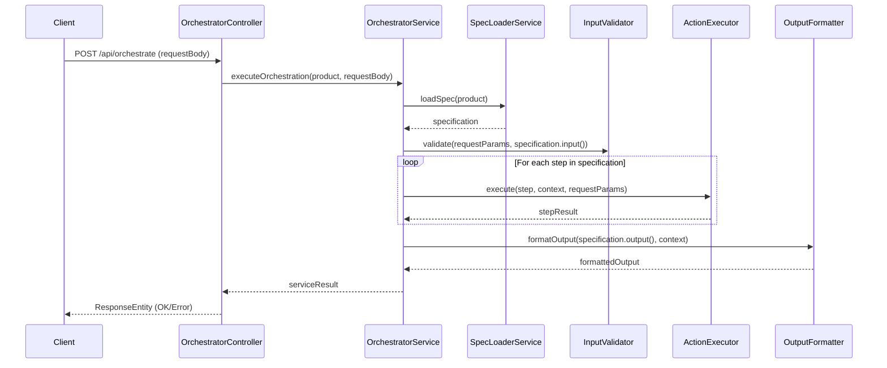

```mermaid
sequenceDiagram
    participant Client
    participant OrchestratorController
    participant OrchestratorService
    participant SpecLoaderService
    participant InputValidator
    participant ActionExecutor
    participant OutputFormatter

    Client->>OrchestratorController: POST /api/orchestrate (requestBody)
    OrchestratorController->>OrchestratorService: executeOrchestration(product, requestBody)
    OrchestratorService->>SpecLoaderService: loadSpec(product)
    SpecLoaderService-->>OrchestratorService: specification
    OrchestratorService->>InputValidator: validate(requestParams, specification.input())
    loop For each step in specification
        OrchestratorService->>ActionExecutor: execute(step, context, requestParams)
        ActionExecutor-->>OrchestratorService: stepResult
    end
    OrchestratorService->>OutputFormatter: formatOutput(specification.output(), context)
    OutputFormatter-->>OrchestratorService: formattedOutput
    OrchestratorService-->>OrchestratorController: serviceResult
    OrchestratorController-->>Client: ResponseEntity (OK/Error)
```